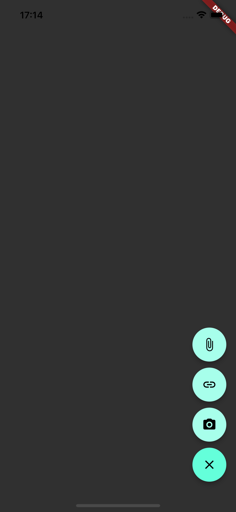
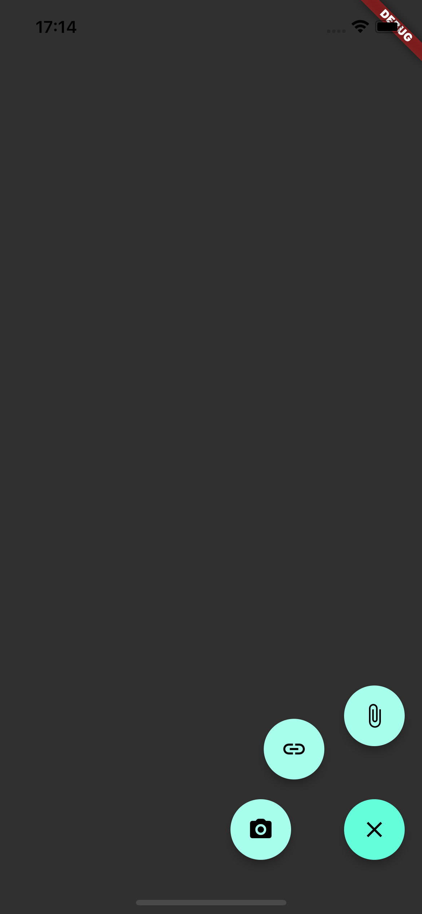
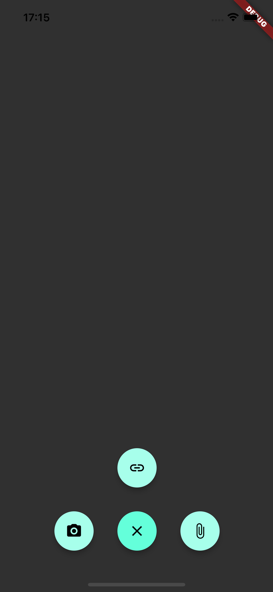
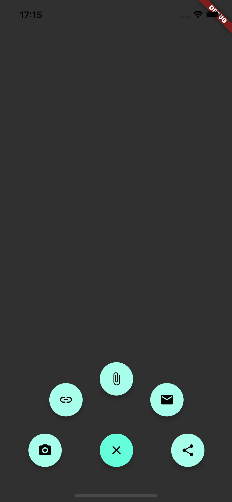

# Floating Animation Menu em Flutter

Três exemplos de menus animados em Flutter a partir de um FAB (Floating Action Button) do Material Design como PoC. Estes menus também são conhecidos como Speed Dial Menu. Os projetos são implementados em Flutter usando a widget `Flow` para posicionamento eficiente de objetos na tela e um `AnimationController` para controlar as animações de abertura e fechamento. 

## Funcionamento
Basicamente a ideia é utilizar a função de `paintChildren` do `FlowDelegate` para "posicionar" dinamicamente cada FAB, baseado no size, no tamanho da tela do app e na posição final que pode ser linear ou baseada em ângulos (para posicionamento circular).

## Exemplos

